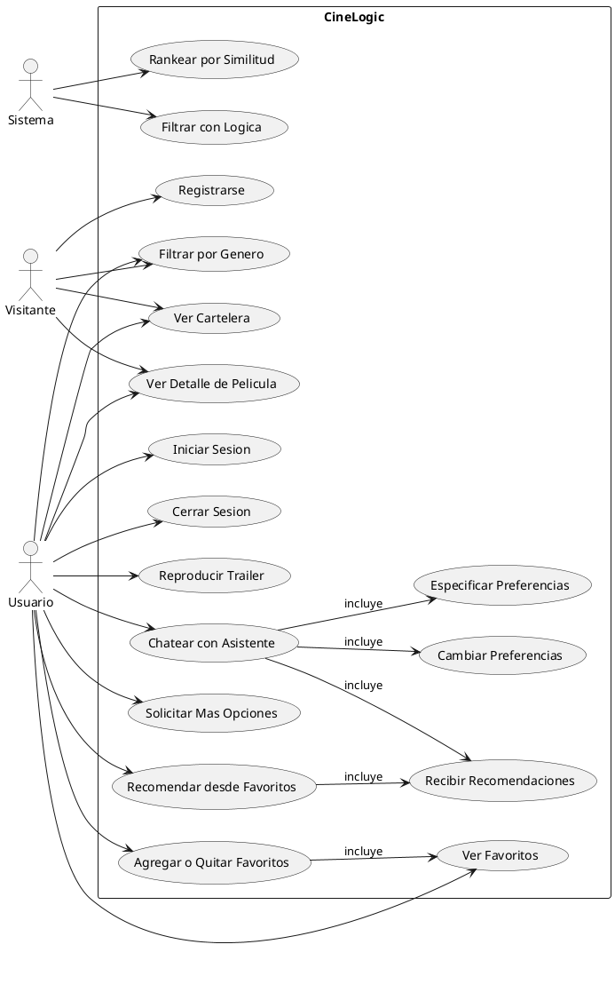
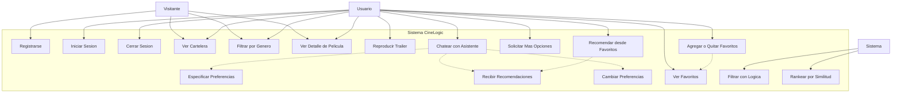

# Diagramas de Casos de Uso - CineLogic

## Actores

- **Visitante**: Usuario no autenticado que navega por el catalogo.
- **Usuario**: Usuario autenticado que puede chatear, recibir recomendaciones y gestionar favoritos.
- **Sistema**: El sistema mismo, que ejecuta logica de negocio (Prolog, Scala, TMDB).

---

## Diagrama PlantUML

---

## Diagrama Mermaid

---

## Leyenda

- `-->` : el actor participa en el caso de uso
- `..>` (Mermaid) / `--> : incluye` (PlantUML) : relacion de inclusion entre casos de uso
- **Visitante**: Solo puede registrarse, ver cartelera, filtrar por genero y ver detalle.
- **Usuario**: Hereda todo lo del visitante (excepto registrarse) y agrega autenticacion, chat, favoritos y recomendaciones.
- **Sistema**: Ejecuta logica interna (Prolog para filtrado deductivo, Scala para ranking TF-IDF).
